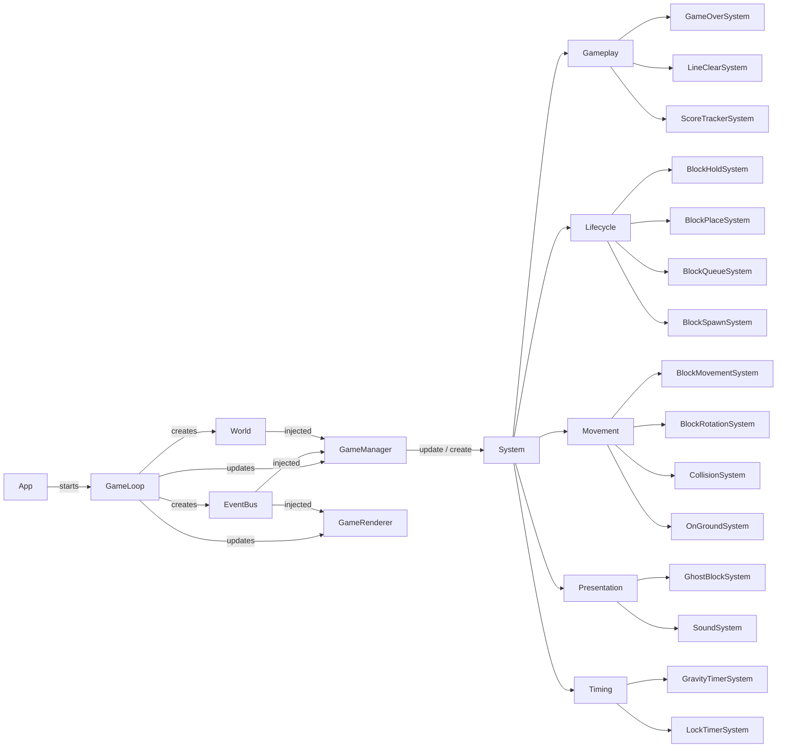
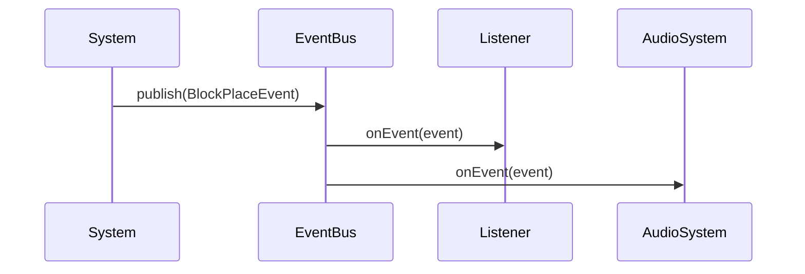
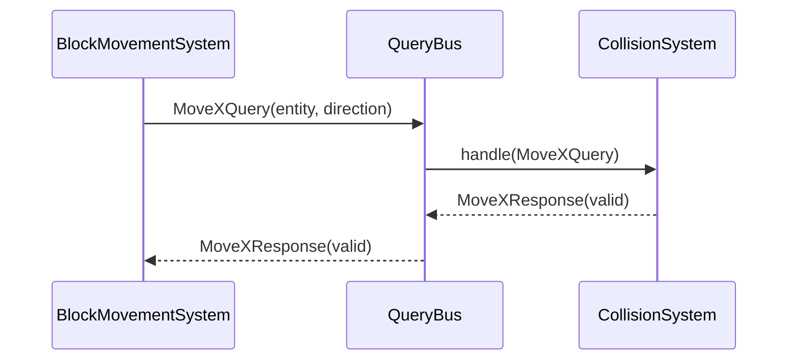

<h1 align="center">Tetrue Lite</h1>

<h3 align="center">An open-source Tetris clone for the terminal, built in Java using the Tetrue Terminal Abstraction Library</h3>

<div align="center">
  
</div>

## Demo


## Features

- Falling Blocks - Standard falling tetrominoes
- Gravity - Drops move down per second and speeds up per line clear
- Lock Grace - Allows adjustment before it gets placed
- SRS Rotation - Based on the SRS Table (Not Implemented on V3.0.0)
- Movement - Move blocks left and right
- Hard Drop - Instantly drop a tetromino to the bottom row
- Scoring - Tracks points for cleared lines
- Block Queueing (7 Bag System) - Next pieces preview and fair randomization
- Hold block
- Configurable Settings
- Sound

## Limitations

- No game / score tracking after the game is closed

## Environment

- Designed and tested primarily on Linux, Windows, and Termux (Android)

## Usage / Controls

- UP Arrow Key - Hard drop
- DOWN Arrow Key - Move tetromino down
- LEFT / RIGHT Arrow Keys - Move tetromino left / right within the grid
- Z Key - Rotate tetromino counter-clockwise
- X Key - Rotate tetromino clockwise
- A key - Rotate tetromino 180 degrees
- C key - Hold block

In the main menu, press `0` or `ESC` to exit the application <br>
In the game, press `ESC` to exit the game

## Installation / Running

### Clone the repository

```bash
git clone git@github.com:BFUR64/tetrue-lite.git
cd tetrue-lite
```

### Build the shadow JAR

#### Windows

```bash
./gradlew build
```

#### Linux / Termux

```bash
sh gradlew build
```

### Run the generated JAR

#### (Java 22 and later)

```bash
java -jar --enable-native-access=ALL-UNNAMED app/build/libs/app-all.jar
```

#### (Java 21)

```bash
java -jar app/build/libs/app-all.jar
```

## Architecture Overview

The game is organized around a central game loop, a set of gameplay
systems, and a shared world state. `GameManager` coordinates the systems
and provides access to the `World` and inter-system communication

The systems are grouped according to their responsibilities:

- **Gameplay** handles game rules and state progression such as scoring,
  line clearing, and game-over detection
- **Lifecycle** manages the creation, holding, queuing, and placement of
  blocks
- **Movement** handles block movement, rotation, collision detection, and
  ground detection
- **Presentation** handles behavior related to displaying or presenting
  game state, such as the ghost block and sound
- **Timing** manages gravity and lock timers



### Inter-System Communication

Systems communicate through two distinct mechanisms: events and queries

Events are used for notifications. A system publishes an event when
something has happened, and any interested listeners can react to it.
The publisher does not expect a response or need to know which systems
are listening



For example, `BlockPlaceSystem` can publish a `BlockPlaceEvent` without
having a direct dependency on `SoundSystem`. `SoundSystem` can listen for
that event and play the appropriate sound

Queries are used when a system requires a response from another part of
the game. The requesting system sends a query through the query bus,
which dispatches it to the appropriate handler. The handler produces a
response that is returned to the requesting system



## Tech Stack

- Programming Language: Java 21 (Adoptium OpenJDK 21.0.11)
- Libraries:
  - [Tetrue Terminal](https://github.com/BFUR64/tetrue-terminal) 3.2.1 (Lanterna-like Abstraction Library for JLine4 and Lanterna)
  - [Menu Manager](https://github.com/BFUR64/menu-manager) 0.9.2 (Personal Composite-based Menu Management)
  - [MicroSound](https://github.com/BFUR64/MicroSound) 0.2.0 (Personal Minimal Sound Manager)
- Build Tools: Gradle 9.7.0

## Version Releasing
MAJOR . MINOR . PATCH

* MAJOR - Breaking Changes
* Minor - Feature Releases / Without breaking the existing API
* Patch - Bug fixes

## Development Environment

Originally built on Termux Neovim on Android, because I found it more convenient than my laptop (Ability to work on the go).

Now, it's mostly tested and built on my laptop ever since the move to JLine 3. I still use Termux to ssh into the laptop and code every now and then if I'm on the go.

## Why I Built This (v1 Tetrue Lite)

After 1.5 years of endless architecturing the 'next best' architecture for the project, I realize my honeymoon phase had to end. It doesn't ship. It only promises.

Tetrue Lite is the v7, with all the unnecessary abstractions / over-engineering gutted or removed, with the focus of delivering an MVP, e.g., an actual playable game.

It was a brutal slap in reality when I realized this.
